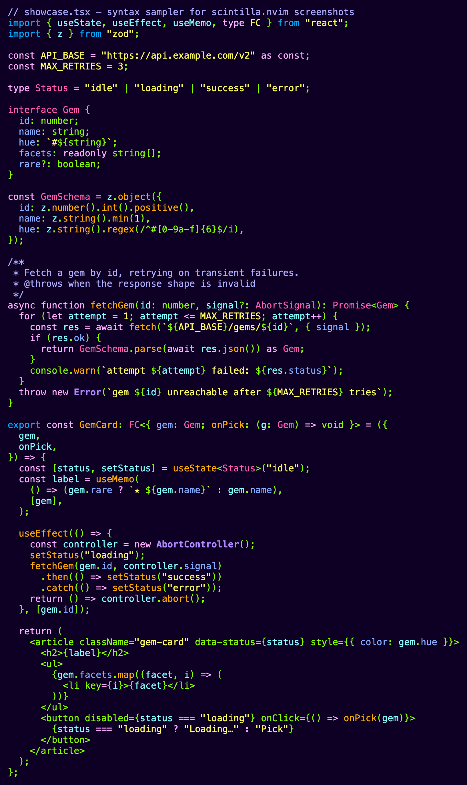
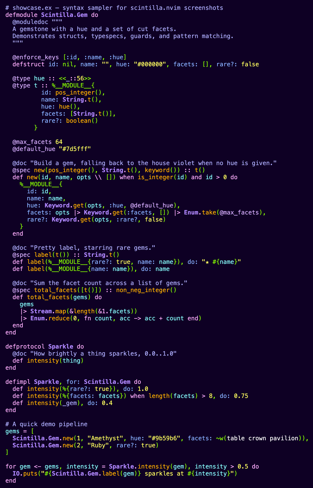
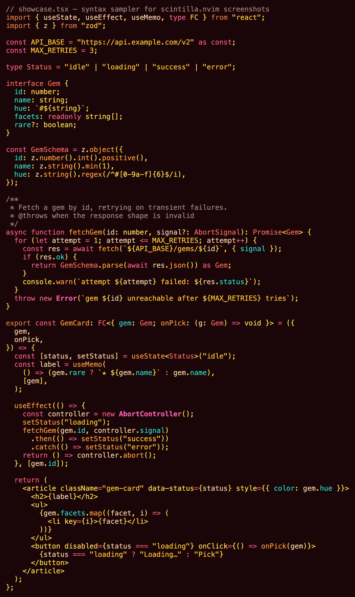
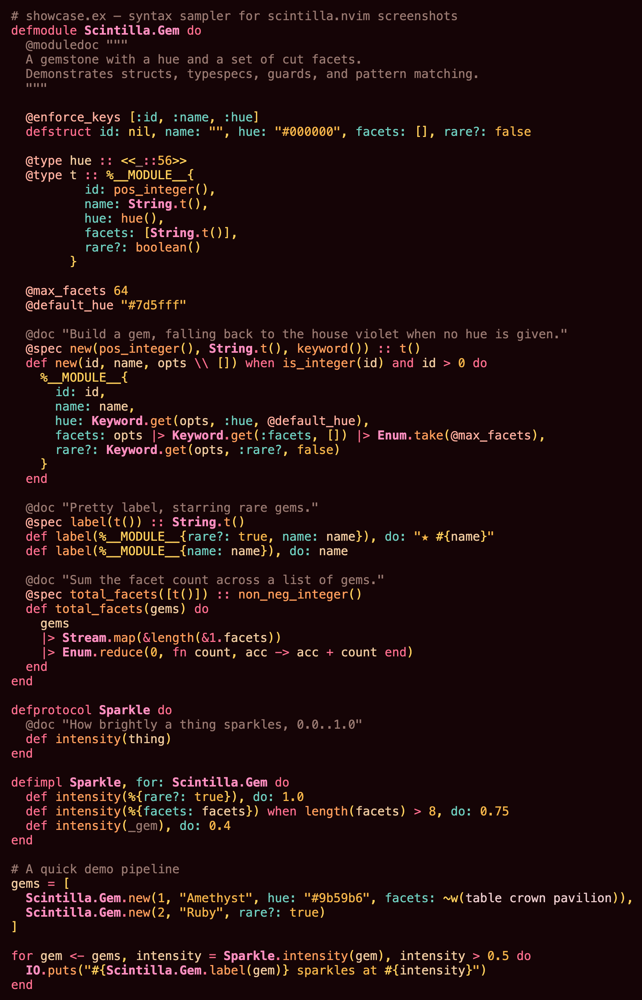
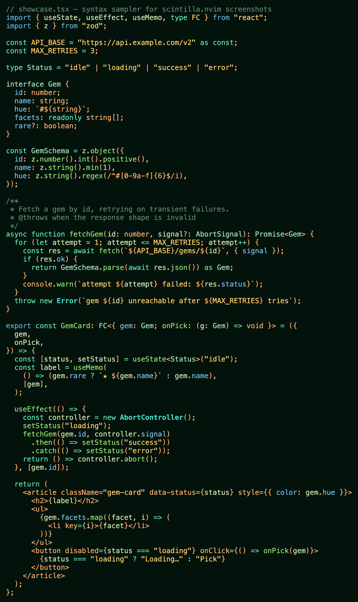
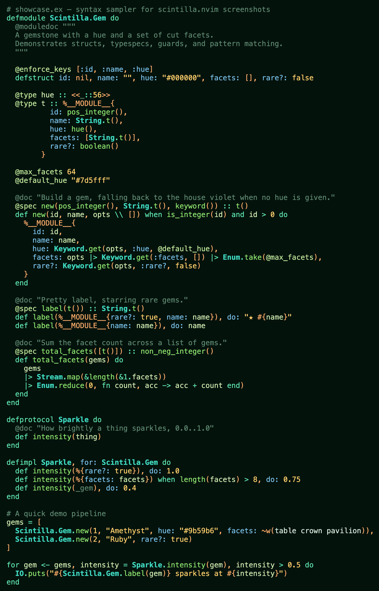
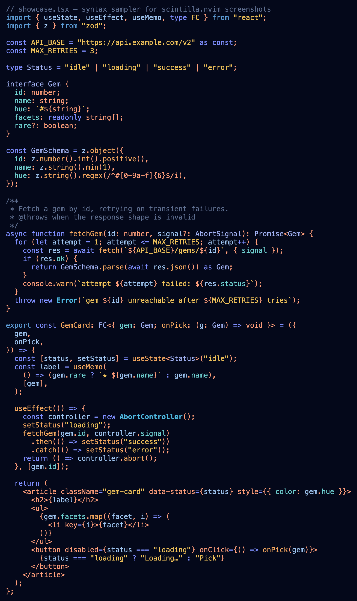
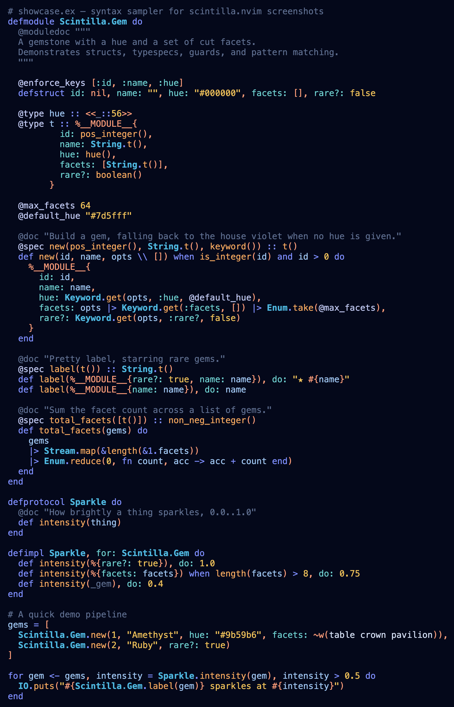

<p align="center">
  
</p>

A family of "deep" colorschemes forked from Neovim's bundled `zaibatsu`, tuned
for everyday TypeScript and Elixir work. Each variant is a deeply-saturated take
on a gemstone.

## Variants

`showcase.tsx` and `showcase.ex` (in [`samples/`](samples)) rendered with
treesitter highlighting. More gems are on the way — each is just a palette swap
over the same shared highlight set.

### 🟣 `scintilla-amethyst`

| `showcase.tsx` | `showcase.ex` |
| --- | --- |
|  |  |

### 🔴 `scintilla-ruby`

| `showcase.tsx` | `showcase.ex` |
| --- | --- |
|  |  |

### 🟢 `scintilla-jade`

| `showcase.tsx` | `showcase.ex` |
| --- | --- |
|  |  |

### 🔵 `scintilla-sapphire`

| `showcase.tsx` | `showcase.ex` |
| --- | --- |
|  |  |

## What's different from zaibatsu

- **Statusline** is a softer accent surface instead of bright white.
- **Floats** (LSP hover, diagnostics, plugin popups, Spectre, Harpoon, etc.) use
  a slightly-lighter-than-bg surface instead of white.
- **Completion popup** (`Pmenu` and friends) matches floats — no white background
  on `<C-x><C-o>`, nvim-cmp, blink, etc.
- **MatchParen** uses accent-on-surface instead of reverse video, so the cursor
  is visible inside matched parens.
- **Treesitter + LSP** highlights are tuned so colors stay stable when the LSP
  attaches (no flicker), and so the major lexical categories — variables,
  object keys / atoms, functions & methods, modules / namespaces / classes,
  strings, and keywords — stay visually distinct.
- **`terminal_color_0`** is lifted from zaibatsu's bg so ANSI-black UI elements
  (lazygit borders inside `:terminal`, etc.) stay visible.

## Install

With `vim.pack`:

```lua
vim.pack.add({ "https://github.com/piacsek/scintilla.nvim" })
vim.cmd.colorscheme("scintilla-amethyst")
```

With `lazy.nvim`:

```lua
{ "piacsek/scintilla.nvim", config = function() vim.cmd.colorscheme("scintilla-amethyst") end }
```

The themes inherit from Neovim's bundled `zaibatsu` (loaded via `:runtime
colors/zaibatsu.vim`), so they require no other dependencies — `zaibatsu` ships
with Neovim.

## Make your terminal follow

Every variant defines the full mirroring surface: `Normal`, `Cursor`,
`Visual`, and all 16 `g:terminal_color_*` ANSI slots tuned to the gem's
palette. Pair it with
[ghostty-mirror.nvim](https://github.com/piacsek/ghostty-mirror.nvim) and
`:colorscheme scintilla-ruby` flips [Ghostty](https://ghostty.org) — and
optionally your tmux statusline — to match, instantly, across every open
window. No theme files to author: ghostty-mirror generates them from the
palette, and its per-theme overrides key naturally to the variant names
(`scintilla-sapphire`, `scintilla-jade`, …).

The demo in ghostty-mirror's README is scintilla doing exactly this.

## Adding a variant

1. Create `lua/scintilla/palettes/<name>.lua` returning a palette table (see
   `amethyst.lua` for the semantic key contract).
2. Create `colors/scintilla-<name>.lua` with a single line:
   `require("scintilla").load("<name>")`.
